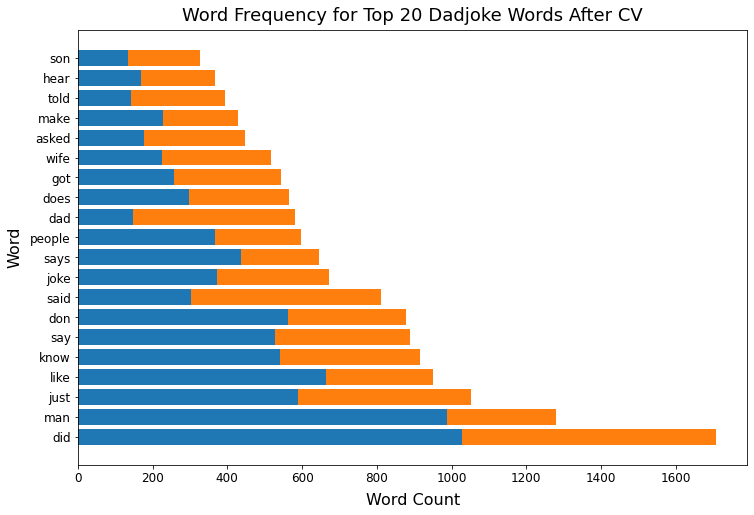
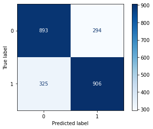
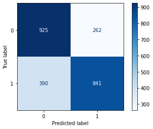
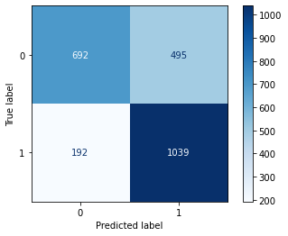

### Classifying Dad Jokes from Anti-Jokes
## Problem Statement

As the world is moving forward technologically, companies are looking for more and more creative ways in order to make their product sell. Apple is in the process of trying to overhaul Siri, making the exeperience of interacting with her more immersive for the user by having her be able to better naviagate some of the nuances of spoken language. 

With this, Apple has made one of the projects to develop a means to better understand humor and jokes. While at the base, dad jokes and antijokes are structured in fairly similar ways, sharing some of the same hooks and relying on a differentiation in the punchline. One relies on the use of puns while the other relies on another form of misdirection and bluntness. Being able to properly differntiate between the two will be able to help Siri give a more dynamic response to consumers, helping to not only improve experience, but also to help promote Apple products through users sharing compelling interactions with Siri. 

## Executive Summary

We have scraped data from Reddit using the PushShift API to collect over 6000 posts from the dadjoke and antijoke subreddits. The rules and structure of these subreddits lend to help with easy classification of the two categories. 

We have chosen to go about modeling and fitting in a comprehensive fashion. Over 20 different types of fits are performed, with broad scanning over hyperparameters for each of the possible models. Both regularized and unregularized logistic regressions, random forests, decision trees, and naive Bayes are used as potential base models. No tokenization, stemming, and lemmatizing are tested, and after an initial test comparing count verctorization vs Tf-idf, TF-idf is used for most of the models. 

After testing all of the models, we are somewhat successful in beating the baseline accuracy of around 50%, with models ranging from an accuracy of 65-74%. This however is not perfect, and in its current state, we recommend choosing a path that has a better recall (correctly guessing dadjokes as dadjokes) or specificity (correctly guessing antijokes as antijokes) to set a better stance as a company until more reliable separation can be performed. 

## Workflow
# 01_data_collection
This is the code used to collect the subreddit information. An arbitrary time of the morning of July 30th was chosen as a start point, and posts are collected from both subreddits, 100 at a time, while actively removing duplicates. This also removes additional `[deleted]` and `[removed]` posts. Although this is common for jokes on reddit, removal was performed for ease. The data is saved at the end to not repeatedly burden Reddit servers. 

# 02_cleaning_and_eda
Cleaning, feature engineering, and EDA are performed. First features are engineered,and potential custom stop words are performed. A hard set of stop words that giveaway subreddits are removed, and protential stopwords are added from English, and overlap between the two in words in common between the top 50 and top 100 most frequent words for each subreddit. Interesting cases show up (dad,son,pink,building). Some are from specific instances (pink) while some are from are give aways to the sub (Dad or son for dadjokes). 

Engineered features are as follows:
 - Add binary `dad` column for whether or not it is from r/dadjokes
 - Add two additional text columns with words stemmed and lemmatized
 - Add sentiment scoers
 - Add `after_isare` to signify jokes that have punchline partially in hook

# 03_modeling_and_results

Ultimately, in the model testing, six sets of stop words are tested. All include a small subset of give aways, while the other six are standard english, top 50, top 100, english + top50, and english + top100 where top50/top100 are overlapping words contained in the top 50/100 words for each sub. These top lists have english stop words pre removed. 

Five pipelines are made, with the best results from full gridsearches used. Commented out include the final set of parameters searched for each fit type. The five pipelines correspond to CountVectoriezer/Naive Bayes, Tfidf/NaiveBayes, Tfidf/Logistic Regression, Tfidf/DecisionTree, and Tfidf/RandomForest. Each pipeline is then applied to each of tokenization set (none, Lemmatizing, stemming). Initial tuning for each pipeline was only performed on the none tokenized set. 

Finally, a LassoLR and RidgeLR were applied to all three tokenized sets. C values were searched over, and the engineered columns were added. Engineered columns weren't used in other instances because I didn't know how to properly incororate them to the pipeline. Limitations to the Lasso and Ridge fits are computer memory that were not encountered in pipline fitting. This is an area for further study. 

## Conclusions and Recommendations

Our model peaks at around 74% accuracy for all unregularized Logistic Regression models, which beats the baseline of ~50%. Depending on corporate goals on the use of this power by Siri, models with similar accuaracy scores and better recall/specificity can be chosen to better categorize a specific type of joke. These peak at a recall score of 84% and specificity of 78% which can be used in the interim until better methods are developed. 

 - No token, Logisitic regression (Best Accuracy)
 
 - No token, Naive Bayes (Highest Specificity)
 
 -Porter Stem, Random Forest (Highest Recall)
 

## Sources
- [r/AntiJokes](https://reddit.com/r/AntiJokes)
- [r/dadjokes](https://reddit.com/r/DadJokes)
- [PushShift](https://github.com/pushshift/api)

